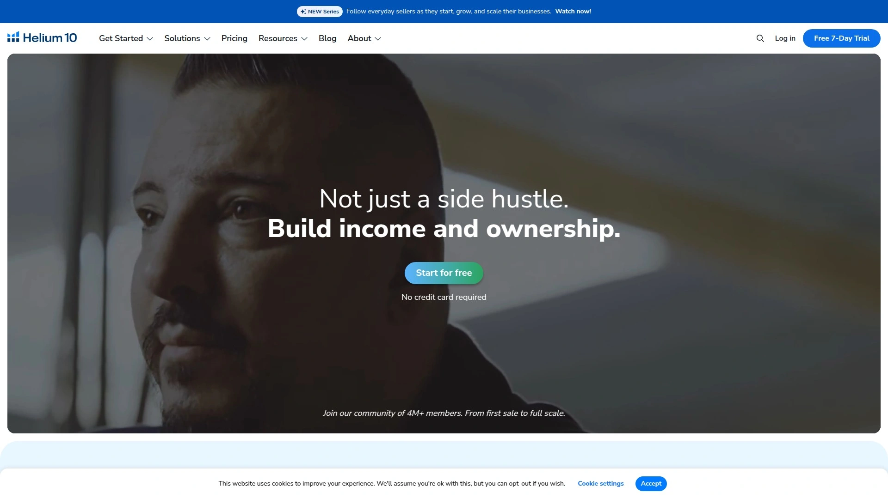
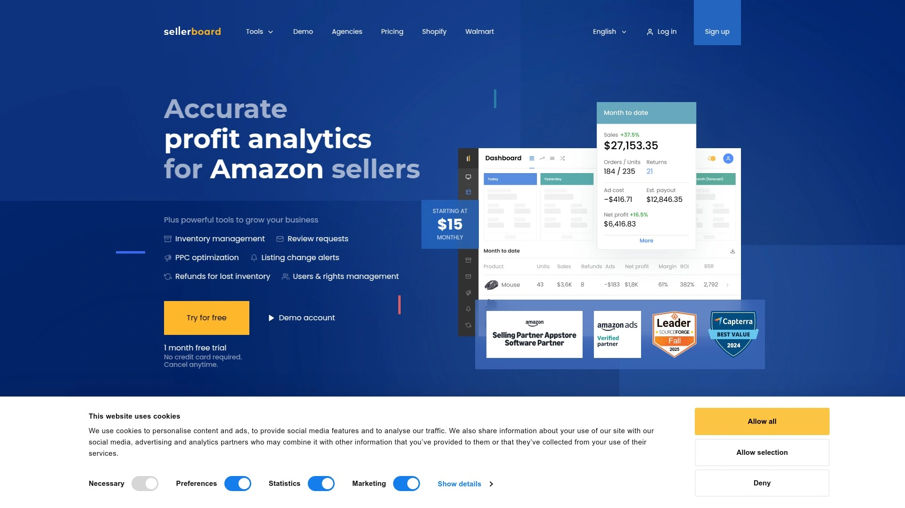
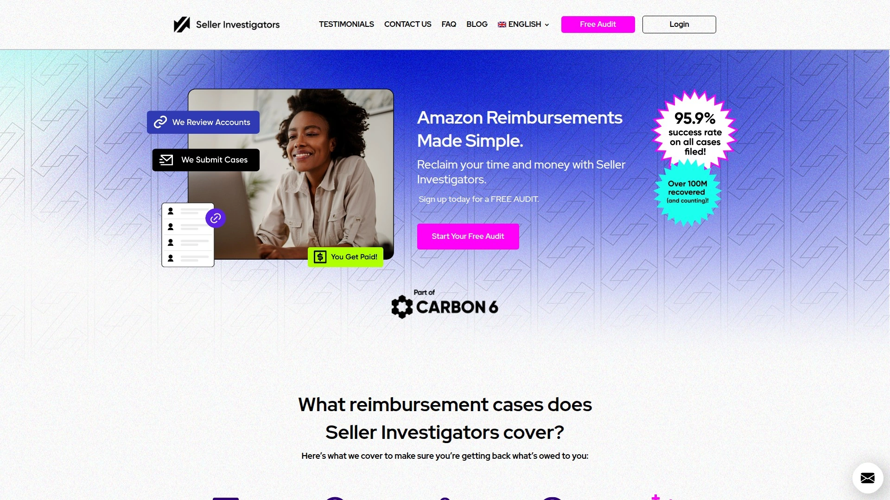
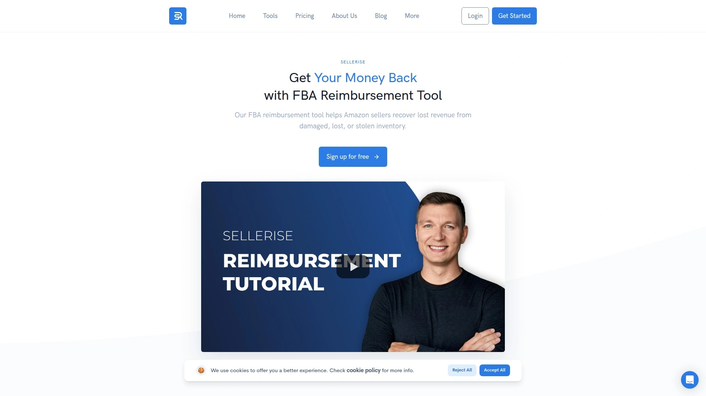
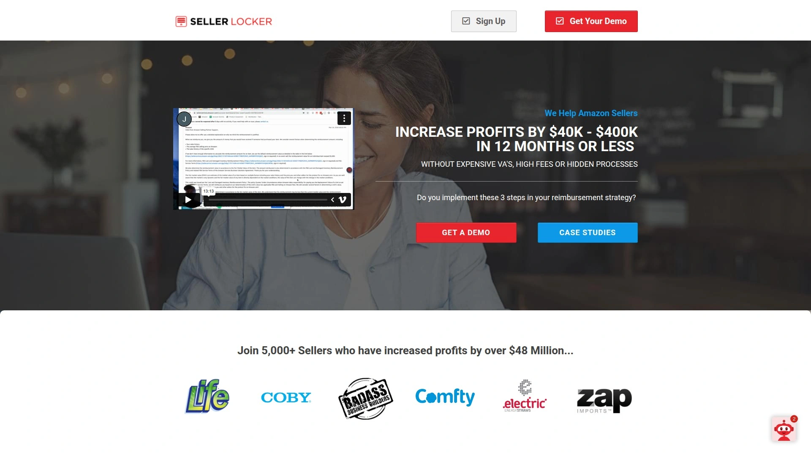
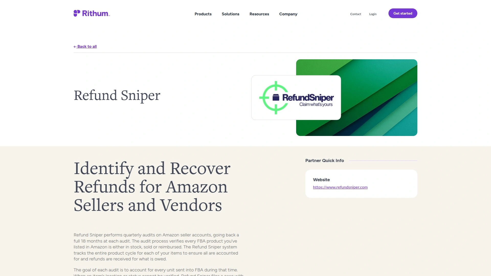
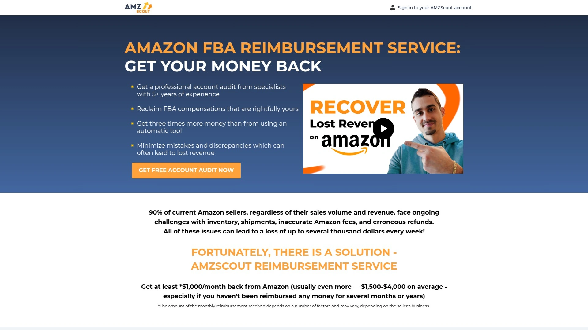
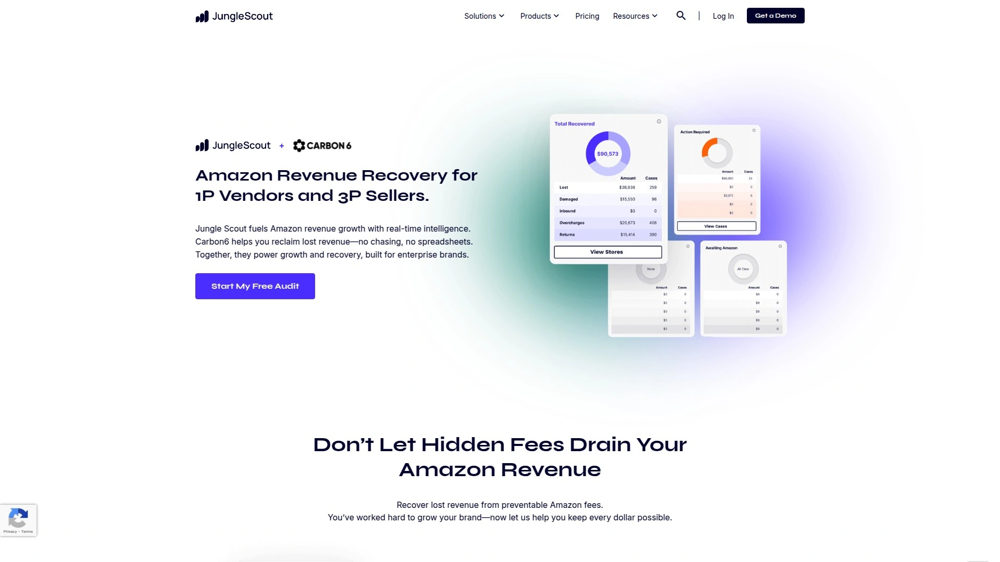
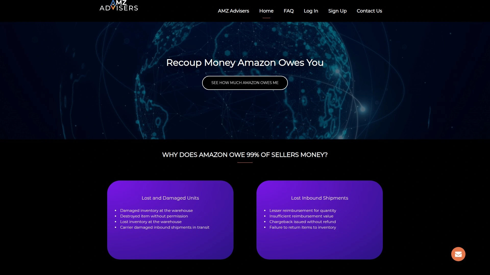
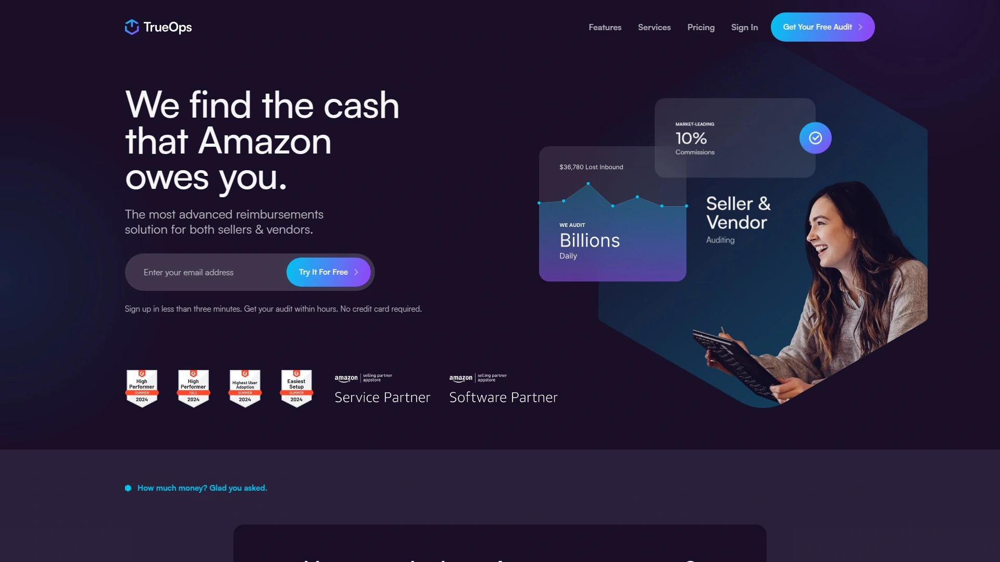

# Top 12 Amazon FBA Reimbursement Services Ranked in 2025 (Latest Compilation)

Running an Amazon FBA business means dealing with lost inventory, damaged products, and fee miscalculations that quietly eat into your profits. Most sellers lose between one and three percent of their annual revenue to these discrepancies—money that's rightfully yours but requires effort to recover. These specialized reimbursement services handle the tedious auditing and claim filing process, turning hidden losses into recovered cash flow so you can focus on growing your business instead of chasing refunds.

***

## **[GETIDA](https://getida.com)**

The global leader in FBA reimbursement with over 125 specialists operating across six countries.

GETIDA stands for GET Intelligent Data Analytics, and they've been in this game since 2015. Founded by former Amazon sellers who knew the reimbursement maze inside out, they built a combination of software and human expertise that's become the industry standard. Their dashboard won a gold award from the American Business Award, which tells you something about how seriously they take transparency.

What makes them different is the team behind the tech. They've got veterans who actually worked in Amazon's reimbursement department, so they know exactly how to navigate the approval process. When you connect your account, their system pulls 18 months of transaction history and flags everything from lost inventory to overcharged fees. Then real humans—not just automated scripts—review each case and manage the entire claim process until you get your money back.

They're listed as an authorized solution provider in Amazon's official app store, which means they've passed Amazon's compliance standards. The platform scans for lost items, damaged goods, customer returns that never made it back to inventory, incorrect disposal charges, and dimension-based fee errors. You get real-time case tracking so you always know what's happening with your claims.

The best part? You only pay when they successfully recover funds. If they find nothing or a claim gets denied, you owe nothing. For sellers doing seven figures or more annually, GETIDA typically uncovers thousands in overlooked reimbursements.

***

## **[Helium 10 Managed Refund Service](https://www.helium10.com)**

Fully automated reimbursement handling built into the leading Amazon seller suite.

Helium 10 took their DIY tool Refund Genie and turned it into something completely hands-off. The Managed Refund Service runs daily audits on your account, automatically files claims with Amazon, and handles resubmissions when cases get denied. Everything happens in the background while you run your business.

The system covers inbound shipment errors, warehouse mistakes, customer return discrepancies, and FBA fee overcharges. When Amazon's dimensions or weight measurements don't match your products, the service catches it and files for correction. You can track everything through your Helium 10 dashboard with direct links to each case in Seller Central.

**Coverage includes:** Missing units during intake, items lost in storage, incorrectly disposed inventory, returns with wrong FNSKUs, unreturned customer items, and fulfillment fee errors. The service also follows up on denied claims by gathering additional documentation and resubmitting when appropriate.

For sellers already using Helium 10 for product research or listing optimization, adding this service means keeping all your tools under one roof. The team manages the entire lifecycle of each claim from detection through resolution.

***

## **[Sellerboard Money Back](https://sellerboard.com)**

Profit analytics platform with built-in reimbursement tracking for DIY-minded sellers.

Sellerboard started as a profit dashboard and added reimbursement features that work differently than most services. Instead of filing claims for you, it generates detailed reports showing exactly what Amazon owes you. You get the transaction IDs, case types, and estimated values in a downloadable spreadsheet.

The tool identifies lost inventory, damaged goods, and customer returns that never made it back into your FBA stock. Their system runs the math automatically—adding up lost and damaged units, then subtracting items Amazon found and already reimbursed. What's left is your opportunity list.

**The workflow:** Download the report, use their provided message templates, open cases in Seller Central, and wait for Amazon's response. It's more manual than other options, but some sellers prefer maintaining direct control over the claim process. You can also use this approach if you're already paying for Sellerboard's profit analytics and want to avoid additional fees.

They include video tutorials walking you through each step, from reading the report to submitting properly formatted requests. For smaller accounts or sellers who enjoy hands-on management, this strikes a balance between automation and oversight.

***

## **[Seller Investigators](https://sellerinvestigators.com)**

Team-driven recovery service that's part of the Carbon6 platform ecosystem.

Unlike software-only solutions, Seller Investigators puts human case managers on your account from day one. They conduct a free audit within 48 hours of signup, showing you exactly what's recoverable before you commit to anything. The team then manages the entire claim submission and follow-up process.

What sets them apart is their approach to compliance. They've been through Amazon's random audits and maintain strict adherence to Amazon's terms of service. When Amazon reverses a reimbursement later, they automatically credit you back on your next invoice—no questions asked.

The service covers the full spectrum: inbound shipment discrepancies, warehouse errors, customer returns with issues, disposal mistakes, and fee calculation errors. Their team typically recovers more cases than automated systems because humans can provide nuanced explanations and supporting documentation that algorithms might miss.

They've helped clients recover over $1 million in some cases, particularly for sellers dealing with high-value inventory where a single lost unit can mean thousands in reimbursements. The 48-hour audit turnaround means you can see potential value fast, and most sellers start seeing money back within 3-5 days after initial case filing.

***

## **[Sellerise Reimbursement Tool](https://sellerise.com/reimbursements-tool)**

Zero-fee reimbursement tool included with their growing seller plan.

Sellerise built their reimbursement feature as a complementary tool rather than a standalone service. If you're on their Growing plan for inventory management or repricing, you get full access to the reimbursement scanner at no additional cost. That's unusual in this space.

The system monitors your account continuously and sends alerts when reimbursement opportunities appear. Advanced algorithms scan for destroyed inventory, misplaced items, lost FBA shipments, customer return issues, damaged stock, and fee discrepancies. When something pops up, you can submit claims in minutes using their pre-written message templates.

**Why sellers like it:** The templates auto-populate transaction IDs and FNSKUs, saving you from digging through Seller Central reports. You can track claim status right in the Sellerise dashboard, and they report a 95 percent approval rate on submitted cases.

The tool shows you exactly how much money you can claim before you file, giving you control over which cases to pursue. For sellers who want visibility without giving up access to a third party, this approach works well. The system stays updated as Amazon introduces new discrepancy types.

***

## **[Seller Locker](https://sellerlocker.clickfunnels.com/sales-page)**

Transparent software suite with prep tools and automatic claim responders.

Seller Locker takes a different angle by giving you the tools to manage reimbursements while maintaining full oversight. Their dashboard displays every transaction and discrepancy in real time, letting you upload supporting documents and submit claims with one click. The automatic responder feature handles follow-ups with Amazon when claims need additional information.

This setup appeals to sellers who worry about handing account access to outside services. You stay in control while the software handles the heavy lifting of organizing data and formatting requests. One seller recovered $350K in three months by using their prep section and responder to clean up previously denied cases.

**The platform covers:** Customer returns damaged in transit, inventory destroyed by Amazon without proper reimbursement, items damaged during inbound processing, lost warehouse stock, and removal order discrepancies. You get free reports showing these opportunities, then decide how to proceed.

Seller Locker is approved in Amazon's Marketplace Appstore, which means they've met Amazon's compliance standards. Their focus on transparency means you can see exactly what's being claimed and why, reducing the black-box feeling some sellers get with fully automated services. Enterprise-level sellers and smaller operations both use the system.

***

## **[Refund Sniper](https://www.rithum.com/partners/refund-sniper/)**

Quarterly audit service that verifies every FBA product over an 18-month window.

Refund Sniper operates on a different schedule than most services. Instead of continuous monitoring, they perform comprehensive quarterly audits going back 18 months each time. The goal is to account for every single unit you've sent into FBA during that period—verifying it's either in stock, sold, or properly reimbursed.

Their system tracks the complete product lifecycle for each item. When something can't be accounted for, they file cases with Amazon to recover the funds. This thorough approach catches discrepancies that shorter audit windows might miss, especially for slower-moving inventory that takes months to cycle through.

They work with both third-party sellers and Vendor Central accounts, which is less common in this space. The quarterly rhythm means you're not getting constant notifications, but you do get deep dives that surface older issues other services might have timed out on.

For sellers who prefer periodic check-ins rather than ongoing monitoring, this model makes sense. You can integrate Refund Sniper alongside other tools you're using without worrying about overlap or duplicate claim filing.

***

## **[AMZScout Reimbursement Service](https://learn.amzscout.net/reimbursement)**

Manual audit service with five-plus years of specialist experience and tailored solutions.

AMZScout built their reimbursement service around human expertise rather than pure automation. Their auditors manually review your Amazon transactions to uncover discrepancies, then create customized recovery strategies for your specific situation. You get detailed reports showing exactly what they found and how they plan to recover it.

The service covers inventory issues from damaged items to warehouse losses, refund problems including missing reimbursements and customer refund overages, shipment concerns from stock counts to damaged returns, and fee errors ranging from restocking charges to incorrect weight-based fees.

**What makes them unique:** They claim to recover three times more money than automatic tools because human auditors catch nuances that algorithms miss. Their global reach means they can navigate any Amazon marketplace, whether you're selling in North America, Europe, or Asia.

One seller recovered $10,000 in the first month without having checked reimbursements in years. AMZScout handles cases that are 17 months old, which is valuable for sellers who've neglected this aspect of their business. The transparent reporting keeps you informed through every stage from initial audit to final payment.

***

## **[Jungle Scout FBA Reimbursements](https://www.junglescout.com/features/fba-reimbursements/)**

Integrated reimbursement solution powered by Carbon6 technology inside Jungle Scout.

Jungle Scout partnered with Carbon6 to bring reimbursement recovery directly into their platform, making it seamless for sellers already using Jungle Scout for product research or sales analytics. The integration means your historic sales data automatically feeds the reimbursement scanner without additional setup.

**How it works:** Link your Amazon account and provide inbound shipment plus order history. Within 48 hours, a dedicated case manager reviews your products, orders, returns, and shipments for reimbursement eligibility. You get a free estimate of recoverable funds, then detailed tracking as they work each case.

The service eliminates manual report downloading and claim filing, giving you a recovery team that handles everything. Most sellers recover funds within three business days of filing, which improves cash flow for reinvestment. The system targets lost inventory, damaged products, incorrect removals, and overcharged fees.

For sellers who want reimbursement tools bundled with their existing software stack, this integration saves time switching between platforms. The Carbon6 backend brings enterprise-level recovery capabilities while Jungle Scout provides the interface you're already familiar with.

***

## **[Refunds Manager](https://refundsmanager.com)**

Expert recovery team for both third-party sellers and 1P Vendor accounts.

Refunds Manager specializes in accounting and dispute resolution with a 99 percent success rate, backed by round-the-clock support. Their software scans for inventory issues up to 17 months back, identifying eligible refunds, fraudulent returns, overcharged storage fees, and payment verification problems.

The platform provides a dedicated dashboard where you can track all your claims in one place. Their case managers submit everything manually rather than relying on automated templates, which they say leads to higher approval rates. The comprehensive data import process looks at every SKU and order on the inventory event level.

**They handle:** Damaged inventory, lost warehouse stock, removal orders gone wrong, customer returns that vanished, overcharged FBA fees, and incorrect refund calculations. The system updates automatically to keep data fresh, ensuring every claim includes your most recent and accurate information.

Their approach combines software scanning with human submission, trying to get the best of both worlds—thorough detection plus nuanced case presentation. For sellers who've had claims denied elsewhere, the manual review process can sometimes turn rejections into approvals.

***

## **[AMZ RefundMe](https://amzrefundme.com)**

Straightforward FBA refund recovery service for third-party sellers.

AMZ RefundMe focuses purely on getting your money back from Amazon without extra complications. They audit your account for the standard range of FBA issues—lost items, damaged inventory, customer returns that disappeared, warehouse disposal errors, and fee overcharges.

The service appeals to sellers who want a no-frills approach to reimbursements. You connect your account, they scan for problems, file claims, and follow up until resolution. There's no complex dashboard or feature overload, just recovery work.

For sellers feeling overwhelmed by too many tools with too many features, this simplified approach cuts through the noise. They handle the Amazon back-and-forth so you don't have to translate between different reimbursement types and claim windows.

The platform works across multiple Amazon marketplaces, so if you sell internationally, you can manage reimbursements for all your accounts in one place. It's a solid option for sellers who prioritize getting results over having elaborate tracking systems.

***

## **[TrueOps](https://www.trueops.com)**

Performance-based recovery service with one of the lowest rates in the industry.

TrueOps entered the reimbursement space with a pricing structure designed to stand out. They're a full-service solution that monitors your account, files cases, and manages all Amazon communication. The platform works for both third-party sellers and 1P vendors, which is less common in this market.

What sellers appreciate is the flexibility. You can pause or delay automated claim filing anytime from your dashboard, giving you the option to handle some claims yourself if you want to test manual approaches. There's no contract requirement, so you can cancel whenever it makes sense for your business.

**The service covers:** Lost inventory, overcharged fees, inbound shipment discrepancies, customer return issues, and warehouse errors. They've built their system to align with Amazon's updated reimbursement policies, including the 2025 shift to manufacturing-cost-based reimbursements instead of selling price.

TrueOps also credits you instantly if Amazon reverses a reimbursement later, which occasionally happens when Amazon reconsiders cases. The onboarding process takes minutes—connect your store and start recovering missed revenue without lengthy setup procedures. For sellers nervous about long commitments, the cancel-anytime policy removes that friction.

***

## FAQ

**How far back can I claim Amazon FBA reimbursements?**

Most reimbursement types allow claims up to 18 months from the date of the issue, though Amazon changed some windows in 2025. Customer return claims specifically have a 60-to-120-day filing window. Services like GETIDA and AMZScout scan the full 18-month history to catch older discrepancies you might have missed. Acting quickly matters because Amazon's clock starts ticking from the transaction date, not from when you discover the problem.

**Will using a reimbursement service risk my Amazon account?**

Reputable services like GETIDA, Seller Investigators, and Jungle Scout are compliant with Amazon's Terms of Service and many appear in Amazon's official Marketplace Appstore. These platforms follow proper claim procedures and avoid flooding Amazon with frivolous requests, which is what actually creates risk. Transparent systems that let you review claims before submission provide extra peace of mind for cautious sellers.

**Can I recover reimbursements if I'm already using Amazon's automatic reimbursement system?**

Absolutely. Amazon automatically reimburses some issues, but their system misses plenty of cases that require manual filing. Services like Sellerboard and Sellerise specifically look for gaps between what Amazon auto-reimbursed and what's actually owed. Many sellers discover thousands in overlooked reimbursements even though Amazon's automated system has been running the whole time.

---

## Conclusion

Recovering lost FBA revenue doesn't have to consume hours of your week digging through reports and fighting with Seller Central support. **[GETIDA](https://getida.com)** handles everything for you with battle-tested processes and former Amazon employees who speak the language of reimbursement approvals—making them the top choice for sellers who want maximum recovery with minimal effort. Whether you're losing hundreds or tens of thousands annually to FBA discrepancies, putting a proper auditing system in place transforms that drain into recovered profit you can reinvest in inventory and growth.
